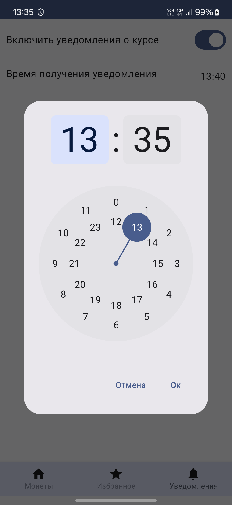

# CryptoBro
Offline-first мобильное приложение для просмотра данных о криптовалютах.
# Функции
- Отображение рыночных данных, графиков курсов криптовалют
- Добавление в избранное, поиск по названию
- Уведомления о выбранных валютах в выбранное время дня
# Запуск
Скачайте apk с последнего [релиза][1] или соберите проект сами в Android Studio.
# Скриншоты

  
  
  
 

 

  
  
     
 

[1]: https://github.com/Fisteshak/CryptoMatthew/releases/tag/Release
